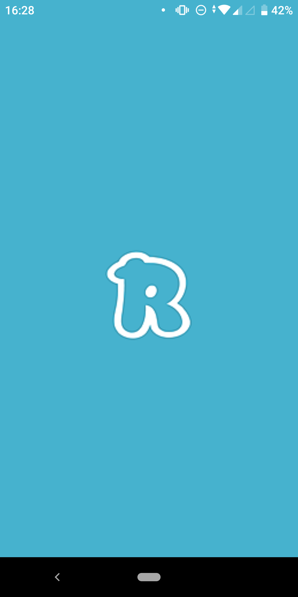
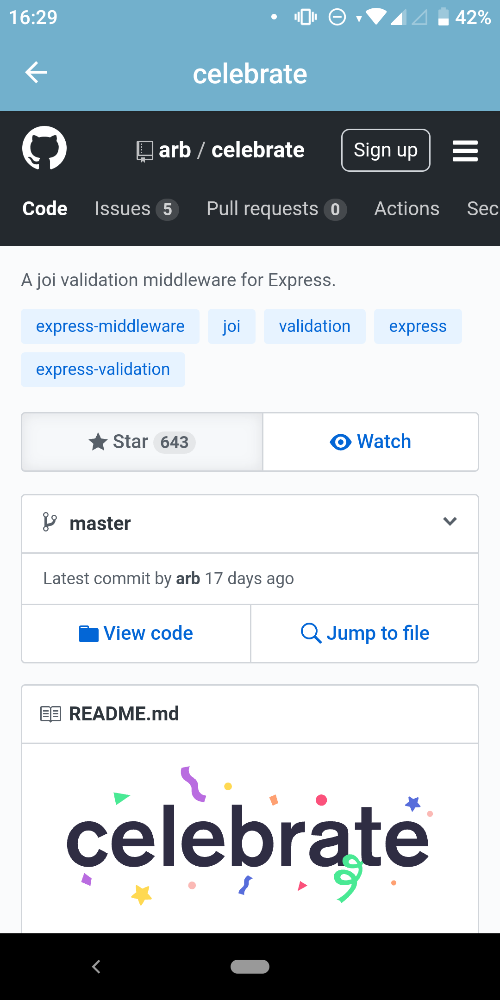

<h3 align="center">
  App Using React Native
</h3>

    

  <a href="#star-about-the-app">About the app</a>&nbsp;&nbsp;&nbsp;|&nbsp;&nbsp;&nbsp;
  <a href="#star-functionalities">Functionalities</a>&nbsp;&nbsp;&nbsp;|&nbsp;&nbsp;&nbsp;
  <a href="#star-printscren">PrintScren</a>

## :star: About the App

Mobile application that allows you to add people from github, show their list of starred git and open
any git using react native webview.

## :star: Functionalities

#### 1. Add user

You can add any user fro github.

#### 2. List starred application

The app list all starred gits from the user you add at.

#### 3. Open starred git

The app allow you to see the git inside the app using react native webview

## :star: PrintScren

  
  
  
  

